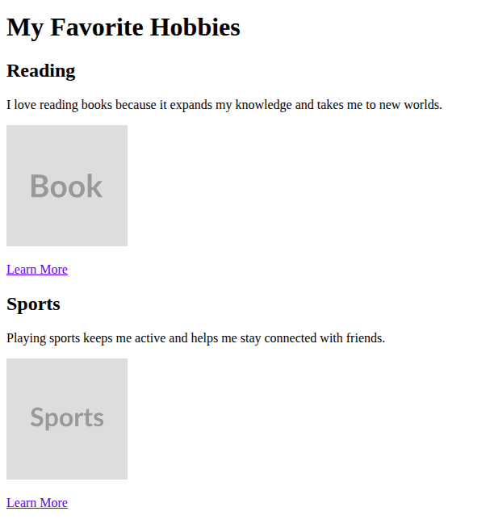
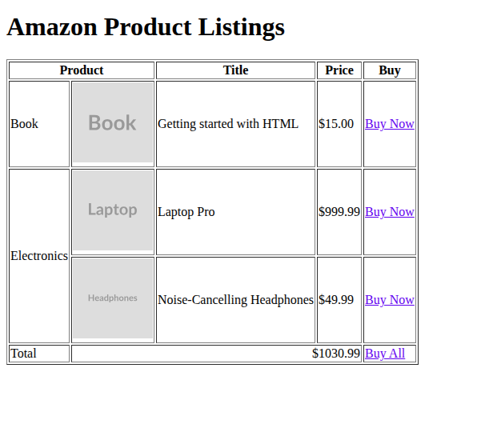
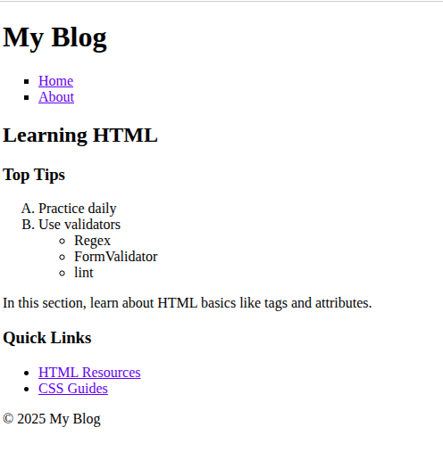
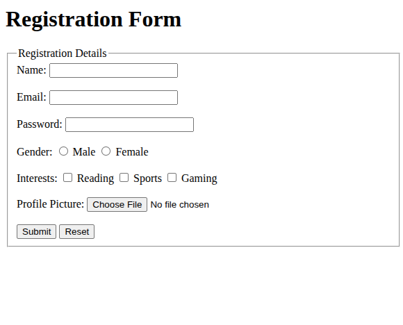

# Chapter 1 : Beginner's Guide to HTML

## What is HTML?

HTML (HyperText Markup Language) is the standard language used to create and structure content on the World Wide Web. It provides the foundation for web pages by defining elements like text, images, links, and multimedia through a system of tags and attributes. HTML is not a programming language but a markup language, meaning it describes how content is organized and displayed in a web browser.

**Purpose**: HTML is used to:
- Structure content (e.g., headings, paragraphs, lists).
- Embed multimedia (images, audio, video).
- Create links to navigate between pages.
- Build forms for user input.
- Enable web accessibility and search engine optimization (SEO) through semantic structure. SEO means that, it will have search engine like Google to find more info about your website.

**How to Create a Sample HTML File**:
1. Open a text editor (e.g., Notepad, VS Code, or Sublime Text).
2. Write HTML code (see example below).
3. Save the file with a `.html` extension (e.g., `index.html`).
4. Open the file in a web browser to view the result.

**Sample HTML File**:
```html
<!DOCTYPE html>
<html lang="en">
<head>
  <title>My First HTML Page</title>
</head>
<body>
  <h1>Welcome to My Page</h1>
  <p>This is a simple HTML page.</p>
</body>
</html>
```


**Steps**:
- Save the above code as `index.html`.
- Double-click the file to open it in your browser. You’ll see a heading and paragraph displayed.

## HTML Syntax

HTML uses **tags** to define elements. Tags are enclosed in angle brackets (`< >`), and most come in pairs: an opening tag (e.g., `<p>`) and a closing tag (e.g., `</p>`). The content goes between them. **Paired tags** wrap content, while **self-closing tags** (e.g., `<br>`) don't need a closing tag and are used for elements without content.

**Attributes** provide additional information about tags, written as `name="value"` inside the opening tag. They customize behavior, like setting a link's destination.

**Purpose**: Tags structure and describe content; attributes add details for functionality or styling.

**Example**:
```html
<!-- Paired tag with attribute -->
<p class="intro">This is a paragraph with a class attribute.</p>

<!-- Self-closing tag -->

```


In this example, you can see that we use the attribute `src` for the location of the image, and `alt` for the description of image.

## DOCTYPE

The `<!DOCTYPE html>` declaration specifies the document type and version (HTML5 in this case). It must be the first line of your HTML file.

**Purpose**: Tells the browser to render the page in standards mode, ensuring consistent display across browsers. Without it, the page might render incorrectly.

**Placement**: At the very top of the HTML file.

**Example**:
```html
<!DOCTYPE html>
<html>
  <!-- Rest of the document -->
</html>
```

## Core Tags

- `<html>`: The root element that wraps all content. Attributes: `lang` (e.g., `lang="en"` for English).
- `<head>`: Contains metadata (not visible on the page) like titles and links to styles/scripts.
- `<body>`: Holds the visible content of the page.

**Purpose**: These form the basic structure. `<html>` defines the document, `<head>` handles behind-the-scenes info, `<body>` shows content, and `lang` aids accessibility and search engines.

**Example**:
```html
<!DOCTYPE html>
<html lang="en">
  <head>
    <title>My First Page</title>
  </head>
  <body>
    <p>Hello, world!</p>
  </body>
</html>
```


## Headings

- `<h1>` to `<h6>`: Headings, with `<h1>` being the largest/most important and `<h6>` the smallest.

**Purpose**: Structure content hierarchically, like chapter titles. Search engines use them for SEO, and they improve readability.

**Example**:
```html
<h1>Main Title</h1>
<h2>Subsection</h2>
<h3>Sub-subsection</h3>
```


## Block and Paragraph Tags

- `<p>`: Defines a paragraph of text. 
- `<div>`: A block-level container for grouping elements (often for styling/layout). Supports `style` for colors.
- `<span>`: An inline container for styling small parts of text. Attributes: `style` for inline CSS (e.g., `style="color: red;"` for red font color).
- `<br>`: Inserts a line break (self-closing).
- `<hr>`: Creates a horizontal rule (line) to separate content. Can use `style` for customization.

**Purpose**: These build basic content blocks. `<p>` for readable text, `<div>` and `<span>` for organization/styling, `<br>` for forced breaks, `<hr>` for visual dividers. The `style` attribute allows inline styling like font color.

**Example**:
```html
<h2>Introduction</h2>
<p>This is a <span style="color: red;">highlighted</span> paragraph.</p>
<div>
  Line one.<br>
  Line two.
</div>
<hr>
```


## Colors in HTML

Colors can be specified in HTML using the `style` attribute (e.g., `style="color: red;"` for text or `style="border: 1px solid blue;"` for borders). Common ways to express colors:
- **Color Names**: Simple names like `red`, `green`, `blue`, `yellow`.
- **Hex Values**: Six-digit codes (e.g., `#FF0000` for red).
- **RGB Values**: `rgb(red, green, blue)` format (e.g., `rgb(255, 0, 0)` for red).

**Sample Colors**:
- Red: `red`, `#FF0000`, `rgb(255, 0, 0)`
- Green: `green`, `#008000`, `rgb(0, 128, 0)`
- Blue: `blue`, `#0000FF`, `rgb(0, 0, 255)`
- Yellow: `yellow`, `#FFFF00`, `rgb(255, 255, 0)`


**Border Styles**: Use `style="border: [width] [style] [color];"` (e.g., `style="border: 2px dotted blue;"`). Common styles:
- `solid`: Continuous line.
- `dotted`: Series of dots.
- `dashed`: Series of dashes.
- `double`: Two parallel lines.

**Example**:
```html
<p style="color: red;">Red text</p>
<p style="color: #008000;">Green text (hex)</p>
<p style="color: rgb(0, 0, 255);">Blue text (RGB)</p>
<p style="border: 1px solid #FFFF00;">Yellow border (hex)</p>
<p style="border: 2px dotted blue;">Dotted blue border</p>
<p style="border: 1px dashed green;">Dashed green border</p>
```


## Images, Audio, and Video

- ``: Embeds an image. Attributes: `src` (source URL/path), `alt` (accessibility text), `width`, `height`.
- `<audio>`: Embeds audio files (e.g., MP3). Attributes: `src`, `controls` (shows playback buttons).
- `<video>`: Embeds video files (e.g., MP4). Attributes: `src`, `controls`, `width`, `height`.

**Purpose**: Add multimedia. `alt` ensures accessibility if the image fails to load or for visually impaired users.

**Example**:
```html

<audio controls>
  <source src="song.mp3" type="audio/mpeg">
</audio>
<video controls width="300">
  <source src="clip.mp4" type="video/mp4">
</video>
```


## Tables

- `<table>`: Creates a table. Attributes: `border` (e.g., `border="1"`), `style` (e.g., `style="border: 1px solid black;"`).
- `<tr>`: Defines a table row.
- `<th>`: Table header cell (bold/centered). Supported attributes: `colspan`, `rowspan`.
- `<td>`: Table data cell. Supported attributes: `colspan`, `rowspan`.
- `colspan` and `rowspan`: Span cells across columns or rows. You give a numeric value like 1 , 2 ..etc indicate how many rows and cols to span.

**Purpose**: Organize data in rows/columns, like spreadsheets. Spanning merges cells for complex layouts.

**Real-Life Example**: A Products table, a regular table.
```html
  <h2>Our Products</h2>
  <p>Check out our web tools:</p>
  <table border="1">
    <tr>
      <th>Product</th>
      <th>Type</th>
      <th>Year</th>
    </tr>
    <tr>
      <td>CodeZap</td>
      <td>Website Builder</td>
      <td>2021</td>
    </tr>
    <tr>
      <td>WebFlow</td>
      <td>CMS Platform</td>
      <td>2023</td>
    </tr>
    <tr>
      <td>PixelCraft</td>
      <td>Design Toolkit</td>
      <td>2024</td>
    </tr>
  </table>
```

**Real-Life Example**: A schedule table, a table with span.
```html
<table border="1">
  <tr>
    <th>Day</th>
    <th>Activity</th>
    <th>Time</th>
  </tr>
  <tr>
    <td rowspan="2">Monday</td>
    <td>Meeting</td>
    <td>9 AM</td>
  </tr>
  <tr>
    <td>Lunch</td>
    <td>12 PM</td>
  </tr>
  <tr>
    <td>Tuesday</td>
    <td colspan="2">Full Day Off</td>
  </tr>
</table>
```


## Links

- `<a>`: Creates a hyperlink. Attributes: `href` (destination URL), `target` (e.g., `target="_blank"` for new tab).

**Absolute Links**: Full URL (e.g., `https://example.com`), for external sites.
**Relative Links**: Local path (e.g., `page.html`), for files in the same site.

**Purpose**: Connect pages or resources. Absolute for external sites; relative for internal navigation.

**Example**:
```html
<a href="https://example.com" target="_blank">Absolute Link</a>
<a href="about.html">Relative Link</a>
```


## Lists

- `<ol>`: Ordered list, with marker types via `type` attribute:
  - `type="1"`: Numeric (default, e.g., 1, 2, 3).
  - `type="A"`: Uppercase letters (e.g., A, B, C).
  - `type="a"`: Lowercase letters (e.g., a, b, c).
  - `type="I"`: Uppercase Roman numerals (e.g., I, II, III).
  - `type="i"`: Lowercase Roman numerals (e.g., i, ii, iii).
- `<ul>`: Unordered list, with bullet styles via `style="list-style-type: ..."`. Options: `disc` (default), `circle`, `square`, or `list-style-image: url('image.png')` for custom images.
- `<li>`: List item, used inside `<ol>` or `<ul>`.

**Purpose**: Display items in sequence (ordered) or without order (unordered). Customize markers for visual clarity.

**Example**:
```html
<ol type="A">
  <li>Step Alpha</li>
  <li>Step Beta</li>
</ol>

<ul type="square;">
  <li>Apple</li>
  <li>Banana</li>
</ul>
```


## Structural Elements

**Purpose**: Semantic structure improves accessibility, SEO, and maintainability. Without CSS, they don't have any effect. They are like div.

- `<header>`: Introductory content, like logos or headings.
- `<nav>`: Navigation links, such as menus.
- `<main>`: Primary content, excluding sidebars/headers.
- `<article>`: Self-contained content, like a blog post.
- `<aside>`: Supplementary content, like sidebars.
- `<section>`: Thematic grouping, like chapters.
- `<footer>`: Footer with copyright or links.


**Example**:
```html
<header>
  <h1>Site Header</h1>
</header>
<nav>
  <ul>
    <li><a href="#">Home</a></li>
  </ul>
</nav>
<main>
  <article>
    <h2>Blog Post</h2>
    <p>Article content.</p>
  </article>
  <aside>
    <p>Related links.</p>
  </aside>
  <section>
    <p>Main content section.</p>
  </section>
</main>
<footer>
  <p>© 2025</p>
</footer>
```


## Metadata

- `<meta>`: Metadata in `<head>`. Common attributes:
  - `charset="UTF-8"`: Sets character encoding.
  - `name="viewport" content="width=device-width, initial-scale=1.0"`: Responsive mobile view.
  - `name="description" content="..."`: SEO description.

**Purpose**: Provide browser/search engine info. Charset prevents encoding issues; viewport aids mobile viewing; description helps SEO.

**Example**:
```html
<meta charset="UTF-8">
<meta name="viewport" content="width=device-width, initial-scale=1.0">
<meta name="description" content="A beginner's HTML guide.">
```

## Special Characters

HTML reserves `<` and `>`. Use entities: `&lt;` for `<`, `&gt;` for `>`, `&amp;` for `&`, `&quot;` for `"`, `&copy;` for `©`.

**Purpose**: Display reserved characters without breaking HTML parsing.

**Example**:
```html
<p>5 &lt; 10 and "quotes" &amp; copyright &copy;</p>
```

## Forms

- `<form>`: Container for inputs. Attributes: `method="get"` (URL data, for searches), `method="post"` (body data, for secure info), `action` (destination URL), `enctype="multipart/form-data"` (for file uploads).
- `<fieldset>`: Groups related elements.
- `<legend>`: Caption for fieldset.
- `<label>`: Labels inputs. Attribute: `for` (matches input `id`).
- `<input>`: Various types (e.g., `type="text"`, `type="password"`). Attributes: `id`, `name`, `required`, `min`, `max`.
- `<textarea>`: Multi-line text. Attributes: `id`, `name`, `rows`, `cols`.
- `<select>`: Dropdown with `<option>` tags. Attributes: `id`, `name`.
- `<option>`: Dropdown item. Attributes: `value`.
- `<input type="checkbox">`: Multiple selections. Attributes: `id`, `name`, `value`.
- `<input type="radio">`: Single selection (same `name`). Attributes: `id`, `name`, `value`.
- `<button>`: Buttons. Attributes: `type="submit"`, `type="reset"`.
- `<input type="file">`: File upload (use `method="post"`, `enctype="multipart/form-data"`).
- Other inputs: `type="range"`, `type="number"`, `type="tel"`, `type="color"`, `type="date"`, `type="time"`, `type="datetime-local"`, `type="month"`, `type="week"`.

**Purpose**: Collect user input. GET for non-sensitive data; POST for secure/file uploads.

**Example**:
```html
<form method="post" action="submit.php" enctype="multipart/form-data">
  <fieldset>
    <legend>Personal Info</legend>
    <label for="name">Name:</label>
    <input type="text" id="name" name="name" required>
    <label for="pass">Password:</label>
    <input type="password" id="pass" name="pass">
    <label for="bio">Bio:</label>
    <textarea id="bio" name="bio" rows="4" cols="50"></textarea>
    <label>Gender:</label>
    <input type="radio" id="male" name="gender" value="male">
    <label for="male">Male</label>
    <input type="radio" id="female" name="gender" value="female">
    <label for="female">Female</label>
    <label>Hobbies:</label>
    <input type="checkbox" id="reading" name="hobbies" value="reading">
    <label for="reading">Reading</label>
    <input type="checkbox" id="sports" name="hobbies" value="sports">
    <label for="sports">Sports</label>
    <label for="country">Country:</label>
    <select id="country" name="country">
      <option value="us">USA</option>
      <option value="ca">Canada</option>
    </select>
    <label for="file">Upload File:</label>
    <input type="file" id="file" name="file">
    <label for="age">Age:</label>
    <input type="range" id="age" name="age" min="1" max="100">
    <input type="number" name="quantity" min="1" max="10">
    <input type="tel" name="phone">
    <input type="color" name="color">
    <input type="date" name="birthday">
  </fieldset>
  <button type="submit">Submit</button>
  <button type="reset">Reset</button>
</form>
```


## Exercises

1. **Basic Page**: Create an HTML page with a DOCTYPE, core tags (`<html>`, `<head>`, `<body>`), headings (use `<h1>` for "My Favorite Hobbies", `<h2>` for subsections like "Reading" and "Sports"), a paragraph (e.g., "I love reading books because it expands my knowledge." with `style="color: blue;"`), an image (use ``), and a link (e.g., `<a href="https://example.com">Learn More</a>`). Save as `index.html` and open in a browser.



2. **Table with Links**: Build a table listing 3 Amazon items (book, laptop, headphones). Columns: Picture (``), Product Name (e.g., "Beginner's HTML"), Price (e.g., "$15.00"), Buy (`<a href="https://amazon.com/...">Buy Now</a>`). Header: Merge first two columns with `<th colspan="2">Product</th>`, then `<th>Price</th>`, `<th>Buy</th>`. Dummy data: Row 1 - ``, "Beginner's HTML", "$15.00", `<a href="https://amazon.com/book">Buy Now</a>`; Row 2 - ``, "Laptop Pro", "$999.99", `<a href="https://amazon.com/laptop">Buy Now</a>`; Row 3 - ``, "Noise-Cancelling Headphones", "$49.99", `<a href="https://amazon.com/headphones">Buy Now</a>`. Add `style="border: 1px solid black;"` to table. Add a final row with `colspan="4"` for a note like "Prices subject to change."



3. **Structured Page**: Create a blog page with `<header>` (`<h1>My Blog</h1>`), `<nav>` (unordered list with links to "Home", "About"), `<main>` with `<article>` (post with `<h2>` and `<p>`), `<aside>` ("Quick Links"), `<section>` (ordered list of tips and a paragraph), and `<footer>` ("© 2025 My Blog").



4. **Form Practice**: Design a registration form with text inputs (`name`, `email`, both `required`), password (`required`), radio buttons (`gender`), checkboxes (interests: Reading, Sports), file upload, and submit/reset buttons. Use `method="post"`, `enctype="multipart/form-data"`, `<fieldset>`, `<legend>Registration Details</legend>`. Add labels with `for` attributes. Test in browser.



## Conclusion

HTML is the backbone of web development, providing structure through tags like headings, lists, tables, and forms. Use `<!DOCTYPE html>`, semantic elements, and attributes like `style` for customization. Practice by creating `.html` files in a text editor and viewing them in a browser. Validate code (e.g., W3C validator) and explore CSS for advanced styling.

## HTML Cheat Sheet

| Tag/Element | Description | Example |
|-------------|-------------|---------|
| `<!DOCTYPE html>` | Declares HTML5 document type. | `<!DOCTYPE html>` |
| `<html lang="en">` | Root element, language attribute. | `<html lang="en">...</html>` |
| `<head>` | Metadata container. | `<head><title>Title</title></head>` |
| `<body>` | Visible content. | `<body><p>Content</p></body>` |
| `<h1>` to `<h6>` | Headings (1 largest). | `<h1>Main</h1>` |
| `<p>` | Paragraph. | `<p>Text</p>` |
| `<p style="color: red;">` | Paragraph with color. | `<p style="color: red;">Text</p>` |
| `<div>` | Block container. | `<div>Group</div>` |
| `<span>` | Inline text. | `<span>Text</span>` |
| `<span style="color: blue;">` | Inline container with color. | `<span style="color: blue;">Text</span>` |
| `<br>` | Line break. | `Line<br>break.` |
| `<hr>` | Horizontal line. | `<hr>` |
| `` | Image. Attributes: `src`, `alt`, `width`, `height`. | `` |
| `<audio controls>` | Audio player. Attributes: `src`, `controls`. | `<audio controls><source src="audio.mp3"></audio>` |
| `<video controls>` | Video player. Attributes: `src`, `controls`, `width`, `height`. | `<video controls width="300"><source src="video.mp4"></video>` |
| `<table style="border: 1px solid black;">` | Table structure. Attributes: `border`, `style`. | `<table style="border: 1px solid black;"><tr><th>Head</th><td>Data</td></tr></table>` |
| `<tr>`, `<th>`, `<td>` | Table row, header, data cells. Attributes: `colspan`, `rowspan`. | `<th colspan="2">Merged</th>` |
| `<a href="...">` | Link. Attributes: `href`, `target`. | `<a href="url" target="_blank">Link</a>` |
| `<ol type="A">` | Ordered list. Attributes: `type="1/A/a/I/i"`. | `<ol type="A"><li>Item</li></ol>` |
| `<ul type="square">` | Unordered list. Attributes: `disc`, `circle`, `square`. | `<ul type="square;"><li>Item</li></ul>` |
| `<li>` | List item. | `<li>Item</li>` |
| `<header>`, `<nav>`, `<main>`, `<article>`, `<aside>`, `<section>`, `<footer>` | Semantic structure. | `<header>Top</header>` |
| `<meta charset="UTF-8">` | Metadata. Attributes: `charset`, `name`, `content`. | `<meta charset="UTF-8">` |
| `&lt;`, `&gt;`, `&amp;`, `&quot;`, `&copy;` | Special characters. | `5 &lt; 10` |
| `<form method="post" action="..." enctype="multipart/form-data">` | Form container. Attributes: `method`, `action`, `enctype`. | `<form method="post" action="submit.php">...</form>` |
| `<fieldset>`, `<legend>` | Group fields. | `<fieldset><legend>Group</legend></fieldset>` |
| `<label for="id">` | Label for input. Attribute: `for`. | `<label for="name">Name</label>` |
| `<input type="text">` | Text input. Attributes: `id`, `name`, `required`. | `<input type="text" id="name" name="name" required>` |
| `<input type="password">` | Password input. Attributes: `id`, `name`. | `<input type="password" id="pass" name="pass">` |
| `<textarea>` | Multi-line text. Attributes: `id`, `name`, `rows`, `cols`. | `<textarea id="bio" name="bio" rows="4"></textarea>` |
| `<select>`, `<option value="...">` | Dropdown. Attributes: `id`, `name` (`select`); `value` (`option`). | `<select id="country" name="country"><option value="us">USA</option></select>` |
| `<input type="checkbox">` | Checkbox. Attributes: `id`, `name`, `value`. | `<input type="checkbox" id="reading" name="hobbies" value="reading">` |
| `<input type="radio">` | Radio button. Attributes: `id`, `name`, `value`. | `<input type="radio" id="male" name="gender" value="male">` |
| `<button type="submit">` | Submit button. Attribute: `type`. | `<button type="submit">Submit</button>` |
| `<button type="reset">` | Reset button. Attribute: `type`. | `<button type="reset">Reset</button>` |
| `<input type="file">` | File upload. Attributes: `id`, `name`. Requires `method="post"`, `enctype`. | `<input type="file" id="file" name="file">` |
| `<input type="range">` | Slider. Attributes: `id`, `name`, `min`, `max`. | `<input type="range" id="age" name="age" min="1" max="100">` |
| `<input type="number">` | Numeric input. Attributes: `id`, `name`, `min`, `max`. | `<input type="number" name="quantity" min="1" max="10">` |
| `<input type="tel">` | Phone input. Attributes: `id`, `name`. | `<input type="tel" name="phone">` |
| `<input type="color">` | Color picker. Attributes: `id`, `name`. | `<input type="color" name="color">` |
| `<input type="date">` | Date picker. Attributes: `id`, `name`. | `<input type="date" name="birthday">` |
| `<input type="time">` | Time picker. Attributes: `id`, `name`. | `<input type="time" name="time">` |
| `<input type="datetime-local">` | Date/time picker. Attributes: `id`, `name`. | `<input type="datetime-local" name="event">` |
| `<input type="month">` | Month picker. Attributes: `id`, `name`. | `<input type="month" name="month">` |
| `<input type="week">` | Week picker. Attributes: `id`, `name`. | `<input type="week" name="week">` |


Generated by Grok with some review and modification
Useful resources

1. W3school: https://www.w3schools.com/html/default.asp
2. Mozilla.org: https://developer.mozilla.org/en-US/docs/Learn_web_development/Core/Structuring_content